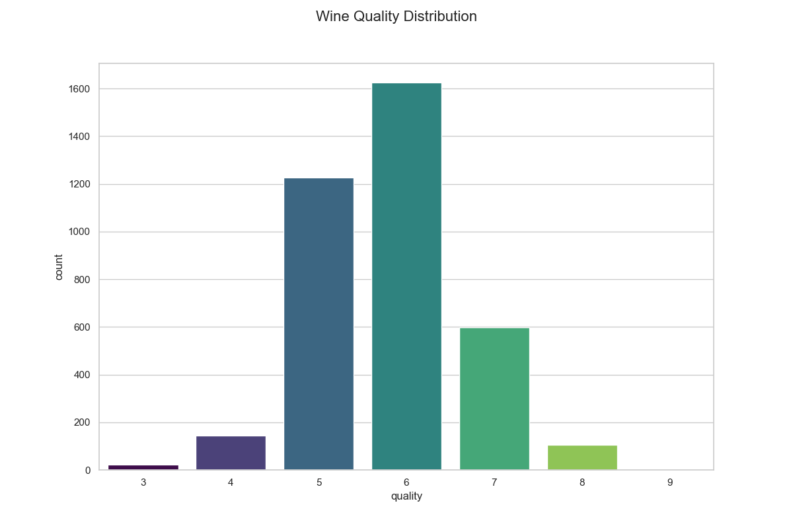
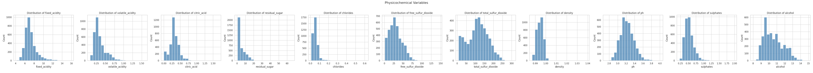
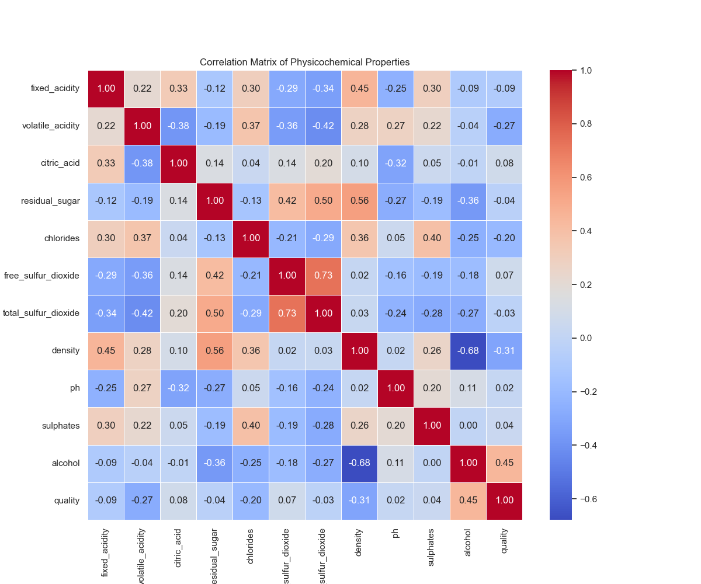
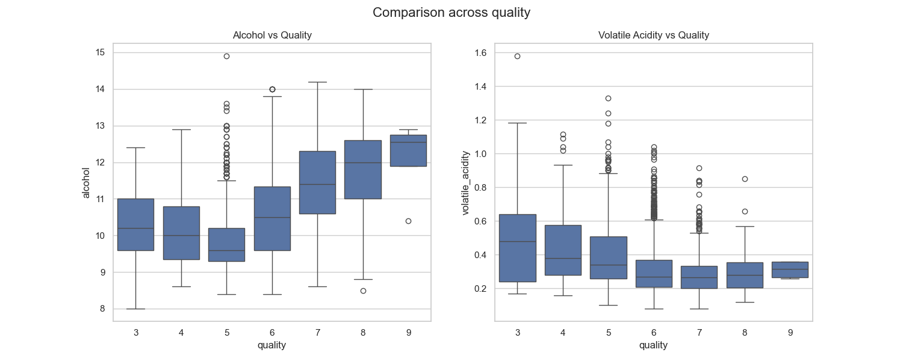
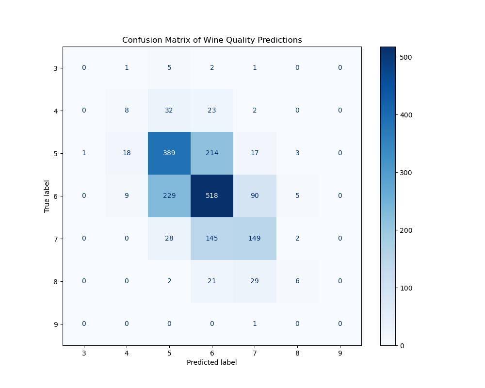

```{python}
import pandas as pd
from IPython.display import Markdown, display
from tabulate import tabulate
```

## Abstract

This study explores the relationship between physicochemical properties and wine quality using the [@cortez2009wine]. We apply a k-Nearest Neighbors (kNN) classification model to predict quality scores based on chemical attributes such as acidity, sugar content, and alcohol levels. 

The dataset consists of 4,898 observations with no missing values. A preprocessing pipeline including feature scaling and encoding was implemented, and hyperparameters were tuned using 5-fold cross-validation. 

The final model achieved an accuracy of 0.55 and a weighted F1-score of 0.54, performing best on the most common quality classes. Results indicate that class imbalance affects performance, particularly for rare quality scores. Future improvements could include alternative models and resampling techniques.

## Introduction 
### Background Introduction : 
This project explores the chemical properties of red and white Vinho Verde wines produced in north Portugal. Although wine quality is traditionally evaluated through sensory analysis, it can also be time-consuming, and difficult to reproduce consistently. As a result, there is growing interest in using data-driven methods to analyze the physicochemical characteristics of wine and predict its perceived quality [@cortez2009modeling]. <br> <br>
The dataset used in this study contains several chemical attributes of wine samples, including acidity levels, sugar content, alcohol concentration, and sulfur dioxide levels. These features provide a description of each wine’s composition and may contain patterns that relate to perceived quality scores. <br><br>
Machine learning techniques with the scikit-learn library [@pedregosa2011scikit] can help uncover these patterns and provide predictive models for wine quality. In this project, we apply a k-Nearest Neighbors (kNN) classification algorithm [@cover1967nearest], a distance-based method that predicts the quality of a wine sample by comparing its physicochemical profile to similar observations in the training dataset. Specifically, this study seeks to answer: To what extent can the physicochemical properties of wine be used to accurately classify its quality rating on a scale of 1–10, and for which quality levels does the model struggle to distinguish between observations?

### Data Description : 
The data is sourced from the UCI Machine Leaning Repository [@cortez2009wine]. We will be working with the `winequality-red.csv` and `winequality-white.csv` dataset. `winequality-red.csv` contains 1599 observations and `winequality-white.csv` contains 4898 observations. Both datasets contain 12 variables including : \
- `fixed acidity` (dbl) - concentration of fixed acids in the wine \
- `volatile acidity` (dbl) - amount of acetic acid, which can give a vinegar taste \
- `citric acid` (dbl) – concentration of citric acid \
- `residual sugar` (dbl) – amount of sugar remaining after fermentation \
- `chlorides (dbl)` – salt content of the wine \
- `free sulfur dioxide` (dbl) – free SO₂ level \
- `total sulfur dioxide` (dbl) – total SO₂ level \
- `density` (dbl) – density of the wine \
- `pH` (dbl) – acidity level of the wine \
- `sulphates` (dbl) – potassium sulphate level (wine preservative) \
- `alcohol` (dbl) – alcohol percentage by volume \
- `quality` (int) – quality score assigned to the wine with score of 1 to 10 (target variable) \


## Methods

### Data Acquisition
The primary data source consists of two separate CSV files hosted on the UCI Machine Learning Repository [@cortez2009wine], representing red and white wine samples. We begin by loading these files directly into our environment.


### Data Cleaning and Standardization
To ensure the datasets can be merged and analyzed seamlessly, we standardize the column names. We convert all headers to lowercase and replace spaces with underscores to prevent syntax errors.


### Data Integration 
Since we plan to analyze both wine types together, we preserve the identity of each observation before merging. We add a categorical column `wine_type` to each dataframe and then concatenate them into a single tidy dataset and saved to the processed data folder.


### Data Partitioning (Train/Test Split)
To avoid data leakage and ensure we can evaluate our model's performance on unseen data, we split the data. We use a 70% training and 30% testing split. We also use stratification on the `quality` variable to ensure both sets have a similar distribution of quality scores.


### Exploratory Data Analysis (EDA)
With our training data isolated, we perform a summary analysis to understand the chemical difference between high-quality and low-quality wines.

First, we visualize the distribution of our target variable, `quality`, to check for class imbalances that might affect our classification results.

{#fig-dist}

@fig-dist reveals that the majority of wines are rated as 5 or 6, while extreme values (3 or 9) are rare.

{#fig-variables}

In @fig-variables, we visualized the distribution of all physicochemical features to assess skewness. While features like `pH` and `density` follow a relatively normal distribution, we observed significant right-skewness in `residual_sugar` and `clorides`. Additionally, we noted vastly different scales across variables (e.g., `total_sulfur_dioxide` vs. `density`), which could lead to biased results in a distance-based algorithm like kNN. These observations suggest that data transformation or feature scaling might be necessary to improve model performance

{#fig-heatmap}

To identify potential predictors for our classification model, we generated a correlation heatmap (@fig-heatmap). This visualization shows that `alcohol` has the strongest positive correlation with quality, while `volatile acidity` shows notable nagative correlations.

```{python}
#| label: tbl-summary
#| tbl-cap: "Mean Chemical Properties by Quality Score"

# load the csv generated by 04_eda_visuals.py script
summary_df = pd.read_csv("../results/figures/summary_statistics.csv", index_col = 0)

summary_df = summary_df.round(4)

# render it as a quarto table
display(Markdown(summary_df.to_markdown()))
```

@tbl-summary summarizes how features like `alcohol` and `volatile_acidity` change as the quality score increases.

Since alcohol and acidity seem important, we look at them more closely across different quality levels.

{#fig-key-features}

@fig-key-features illustrates the relationship between quality and our key chemical features. We observe there is a general upward trend in alcohol content as quality improves. Similarly, volatile acidity shows an overall downward trajectory as quality increases.

In summary, our exploratory analysis confirms that while no single physicochemical property perfectly separates the wine quality ratings, distinct patterns exist in features like `alcohol` and `volatile_acidity`.

Although @fig-heatmap reveals that some variables have weaker linear relationships with the target, we have elected to retain the full set of 11 features for the initial classification phase. This approach ensures that the kNN algorithm can leverage the high-dimensional neighborhoods of the data, capturing complex multivariate interactions that simple pairwise correlations might miss.

However, given the significant disparities in feature scales identified in @fig-variables, standardization (Z-score scaling) will be a mandatory step in the modeling pipeline to ensure that distance-based calculations are not biased by the magnitude of individual variables. The dataset is now cleaned, verified for integrity, and prepared for the training of our kNN classifier

### kNN analysis

To classify wine quality, we implement a k-Nearest Neighbors (kNN) model that predicts each wine’s rating based on the most similar observations in the dataset. Since kNN relies on distance calculations, all numerical features are standardized to ensure that variables measured on larger scales do not dominate the model. In addition, the categorical variable wine_type is encoded so that both red and white wines can be incorporated into the analysis.

To improve model performance, we tune the number of neighbors (k) using cross-validation. By evaluating multiple values of k, [@cover1967nearest] identifies the optimal balance between capturing local structure and avoiding overfitting. Smaller values of k allow the model to closely follow the training data, while larger values produce smoother decision boundaries that generalize better to new observations.

This approach is particularly useful given the patterns observed in @fig-heatmap and @fig-key-features, where wine quality is influenced by multiple interacting physicochemical properties rather than a single dominant factor. By considering similarity across all features simultaneously, kNN is able to capture these multivariate relationships without imposing strict assumptions about the data.

Overall, the [@cover1967nearest] provides a flexible and intuitive method for classifying wine quality. However, its performance remains sensitive to feature scaling and the distribution of quality scores, meaning that the class imbalance observed in @fig-dist may still influence how well the model distinguishes between less common quality levels.

### Model evaluation

```{python}
import re

# load the text report
with open("../results/metrics.txt", "r") as f:
    report_content = f.read()

# extract accuracy
acc_match = re.search(r"Accuracy:\s+([\d\.]+)", report_content)
accuracy_val = float(acc_match.group(1)) if acc_match else 0.0
accuracy_pct = f"{accuracy_val * 100:.1f}%"

# extract weighted avg F1-score 
f1_match = re.search(r"weighted avg\s+[\d\.]+\s+[\d\.]+\s+([\d\.]+)", report_content)
f1_val = f1_match.group(1) if f1_match else "0.00"
```

```{python}
#| label: tbl-results
#| tbl-cap: "kNN Classifier Performance Metrics"

# print the full report
print(report_content)
```

The calculated F1 score of the model `{python} f1_val` suggests that the model is okay but not great. The model is picking the majority classes better than rare classes so there is a slight class imbalance.

{#fig-confusion-matrix}

From the confusion matrix (@fig-confusion-matrix), we can see that most of the correct predictions are in quality scores of 5 and 6 which are majority classes and some predictions of actual 3,4,8 quality scores are also mistakenly classified as 5 or 6 showing that the model is biased towards majority classes.

#### Classification Report
The model predicts the most common wine quality scores (5 and 6) reasonably well, with F1-scores around `{python} f1_val`, reflecting good precision and recall for these classes. <br>
Rare quality scores (3, 4, 8, 9) have very low F1-scores, indicating that the model struggles to identify wines with these scores correctly, likely due to their low frequency in the dataset.

The model predicts the exact wine quality accurately `{python} accuracy_pct` of the time. This accuracy is higher than random guessing (1/10), so the model learns something, but still misses accurate predictions almost half of the time.  

## Results
In answering our research question regarding the extent of kNN's predictive power, our model, optimized through cross-validation, achieved a classification accuracy of approximately `{python} accuracy_pct` and a weighted F1-score of `{python} f1_val`. As shown in the confusion matrix, the model performs strongest when predicting the most frequent quality scores (5 and 6), which represent the majority of the dataset. However, addressing the second part of our question, the model struggles significantly to distinguish between observations at the extremes of the scale (quality scores of 3, 4, 8, and 9). These results confirm that while chemical properties provide a strong signal for average wine quality, they are less effective at distinguishing between exceptionally high or low quality wines without a more balanced training set.

## Discussion
**Summary of Findings**

In this study, we explored whether the physicochemical properties of wine could accurately predict its quality rating. Our [@cover1967nearest] achieved an accuracy of `{python} accuracy_pct`. The model performed best at identifying wines with quality scores of 5 and 6, which represent the majority of our dataset. However, it significantly struggled to correctly classify wines at the high (8+) and low (3-4) ends of the quality scale.

**Expectations vs. Reality**

We expected that by including all 11 physicochemical features and applying StandardScaler, [@cover1967nearest] would be able to draw clear boundaries between quality classes. While our EDA showed that alcohol and volatile acidity are strong indicators, the model's moderate accuracy suggests that there is a high degree of overlap in the chemical neighborhoods of different wine qualities. Our results align with the initial findings of [@cortez2009modeling], who noted that while chemical properties are influential, human preference remains a highly complex variable to model mathematically.

**Impact of Findings**

The impact of these findings for the wine industry is that automated chemical analysis can serve as a useful initial screening tool to identify average wines. However, because the model struggles with rare quality scores, it cannot currently replace human expert sensory evaluation for identifying premium or defective products. For winemakers, this suggests that chemical composition is a strong foundation for quality, but not the entire story.

**Future Questions**

This study leads to several interesting questions for future research:
1. Would a more complex model, such as a Random Forest or Support Vector Machine (SVM), better handle the nonlinear relationships in the data?
2. Are there other chemical markers, such as specific flavor compounds or tannins, that were not in this dataset but could improve prediction accuracy?


## References

